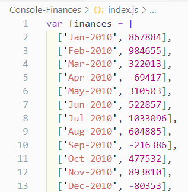
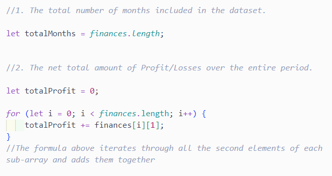
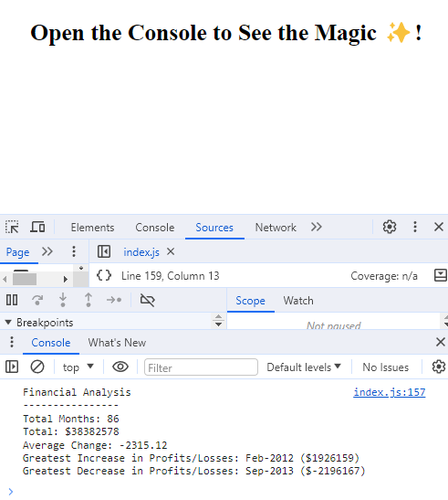

# Console-Finances

This repository contains my answer to the Module 4 Challenge of the Web Development edX bootcamp. 

## Description

My task was to create code for analyzing the financial records of a company. I was provided with a financial dataset by edX. The changes were made to the JavaScript file and the results have been printed to the console.

## Table of Contents

* [Installation](#installation)
* [Usage](#usage)
* [Credits](#credits)
* [License](#license)

## Installation

N/A

## Usage

This is a brief overview of what the challenge looked like and how you may view my response to it.

#### JavaScript code I was presented with:

---

#### Example of JavaScript code I wrote
As can be seen below, I added comments to introduce the different tasks I was asked to do, as well as to explain my response to those tasks:

---

#### The final analysis
You can scroll down to the end of the Javascript file to see what I printed to the console. The results appear all together in the 'Console' tab of the html file.

## Credits

Tutorials of W3Schools were consulted to complete this project.

## License

Licensed under the MIT license.